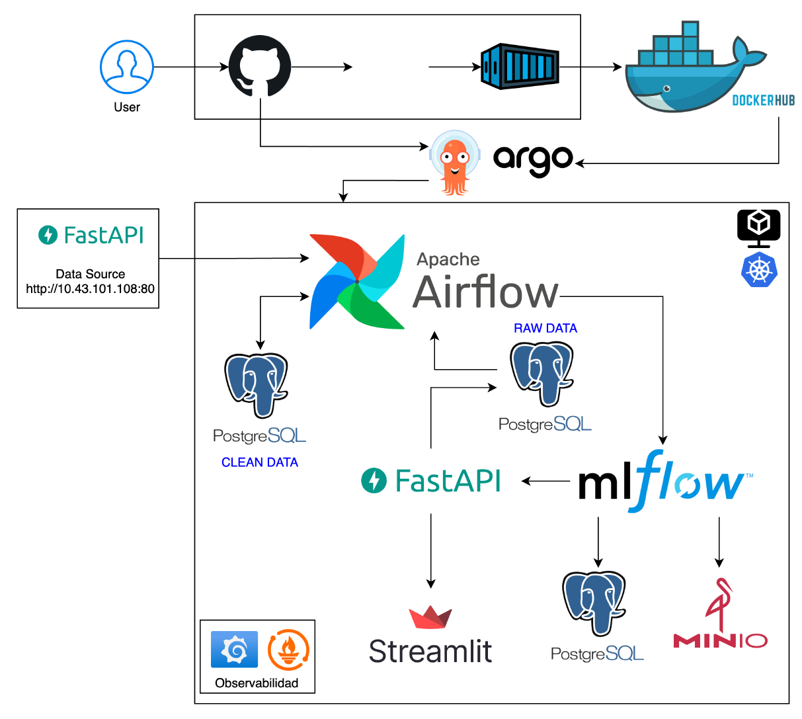
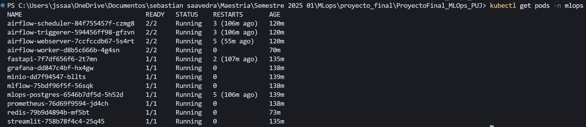
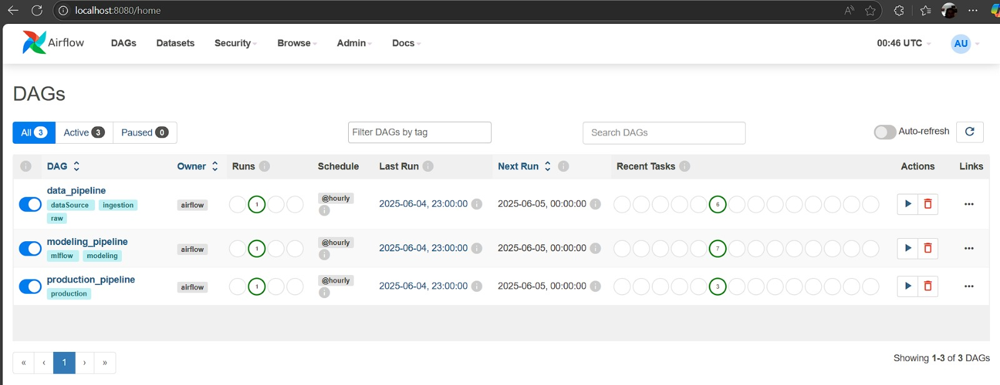
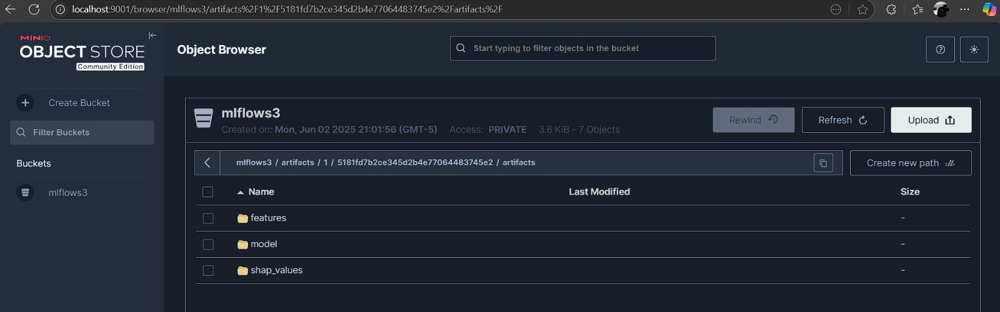
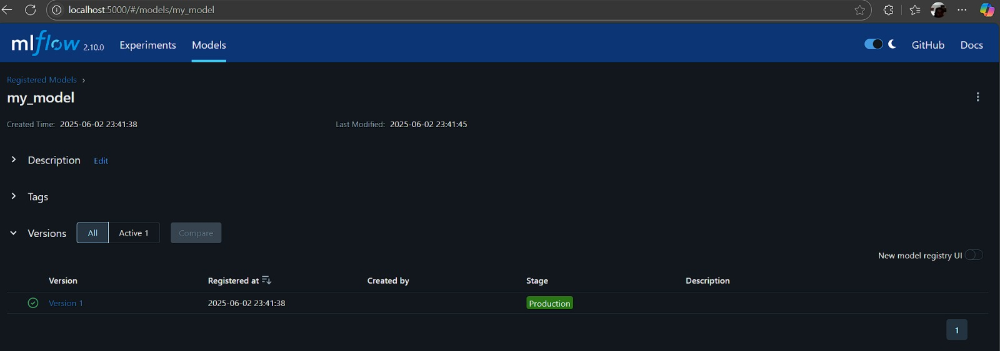
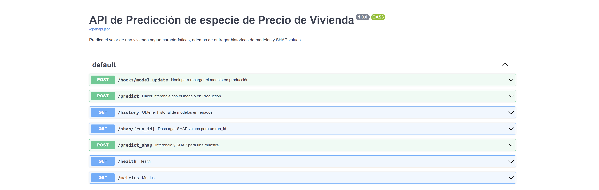
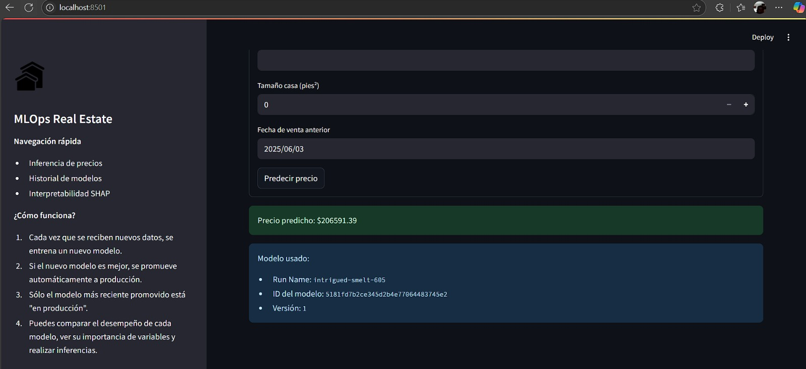
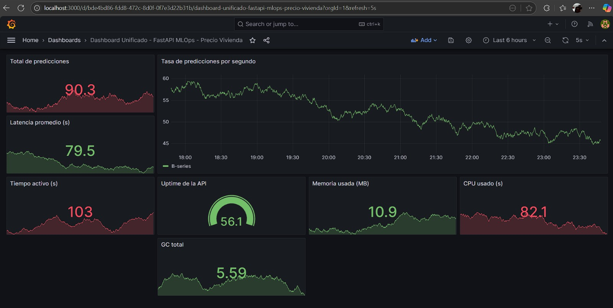

# Proyecto Final MLOps

Este repositorio documenta el proceso de desarrollo y despliegue de una arquitectura MLOps, iniciando con Docker Compose, seguido de la publicación de imágenes en Docker Hub, migración a Kubernetes mediante manifiestos y, finalmente, la integración y despliegue con Helm Charts. El objetivo es proporcionar una guía clara y replicable para usuarios interesados en implementar una solución MLOps completa.


## Arquitectura y componentes

A continuación, se describen los componentes que conforman la arquitectura de despliegue de este proyecto. Cada uno de ellos cumple una función específica dentro del entorno de ejecución y ha sido seleccionado para garantizar una operación eficiente, modular y escalable.

<div align="center">  </div>

### Componentes

- **PostgreSQL**: Base de datos para Airflow y MLflow
- **Redis**: Broker para Airflow Celery Executor
- **Airflow**: Orquestador de flujos de trabajo
- **MinIO**: Almacenamiento de objetos compatible con S3
- **MLflow**: Gestión del ciclo de vida de ML
- **FastAPI**: API para servir modelos de ML
- **Streamlit**: Interfaz de usuario
- **Prometheus**: Monitoreo de métricas
- **Grafana**: Visualización de métricas

## Acceso y Pruebas de la API

Para verificar la conectividad y el funcionamiento de la API de datos, se recomienda realizar los siguientes pasos:

1. Comprobar la respuesta de la API mediante ping:
   ```bash
   ping 10.43.101.108
   ```
   

2. Verificar la conectividad al endpoint raíz:
   ```bash
   curl http://10.43.101.108:80
   ```
   

3. Consultar el contenido de la API:
   ```bash
   curl http://10.43.101.108:80/openapi.json
   ```

Las rutas disponibles en la API son:
- `/metrics` (GET): Exposición de métricas para Prometheus.
- `/health` (GET): Verificación de estado (status OK).
- `/data` (GET): Requiere los parámetros `group_number` y `day`.
- `/restart_data_generation` (GET): Requiere los parámetros `group_number` y `day`.

Ejemplo de consulta de datos:
```plaintext
http://10.43.101.108:80/data?group_number=6&day=Wednesday
```
Ejemplo para reiniciar el contador de solicitudes:
```plaintext
http://10.43.101.108:80/restart_data_generation?group_number=6&day=Wednesday
```


## Despliegue Inicial con Docker Compose

El proceso inicia con el levantamiento automático de la arquitectura mediante Docker Compose. Los comandos principales son:

- Inicialización de Airflow:
  ```bash
  docker compose up airflow-init 
  ```
- Construcción y despliegue de los servicios:
  ```bash
  docker compose up --build -d 
  ```
- Eliminación completa de la arquitectura:
  ```bash
  docker compose down -v --rmi all 
  ```

Para el seguimiento de las tablas y almacenamiento en la base de datos PostgreSQL:
```bash
docker compose exec mlops-postgres psql -U airflow -d airflow -c "\l"
docker compose exec mlops-postgres psql -U airflow -d airflow -c "\dt *.*"
```

Accesos a los servicios principales:
- Airflow: http://localhost:8080
- MinIO: http://localhost:9001
- MLflow: http://localhost:5000
- API del modelo: http://localhost:8989
- Prometheus: http://localhost:9090
- Grafana: http://localhost:3000

> Nota: El servicio JupyterLab fue eliminado tras su uso en pruebas.

## Ejemplos de Consumo de la API del Modelo

Se presentan ejemplos de payload para el consumo del modelo vía API:

```json
{
  "features": {
    "brokered_by": 101,
    "status": "for sale",
    "bed": 3,
    "bath": 2,
    "acre_lot": 0.25,
    "street": "123 elm st",
    "city": "springfield",
    "state": "illinois",
    "zip_code": "62704",
    "house_size": 1500,
    "prev_sold_date": "2022-03-15"
  }
}
```
```json
{
  "features": {
    "brokered_by": 55,
    "status": "for sale",
    "bed": 4,
    "bath": 3,
    "acre_lot": 0.4,
    "street": "456 oak ave",
    "city": "shelbyville",
    "state": "illinois",
    "zip_code": "62565",
    "house_size": 1800,
    "prev_sold_date": "2023-01-22"
  }
}
```

## Publicación de Imágenes en Docker Hub

Cada servicio desarrollado se construye y publica individualmente en Docker Hub, siguiendo el esquema: construcción → publicación → actualización de Docker Compose → migración a manifiestos.

Ejemplo de comandos para la publicación:
```bash
docker build -t blutenherz/airflow-mlops:1.0.0 .
docker push blutenherz/airflow-mlops:1.0.0
# Repetir para cada servicio: fastapi, minio, mlflow, streamlit
```

## Migración a Kubernetes

La migración a Kubernetes se realiza en el directorio `k8s`, donde se encuentran los manifiestos para cada microservicio, utilizando imágenes personalizadas y públicas según corresponda.

Verificación de la versión de kubectl:
```bash
kubectl version --client 
```

### Guía Completa de Despliegue en Kubernetes


#### Requisitos Previos

- Cluster de Kubernetes (Minikube, K3s, EKS, AKS, GKE, etc.)
- kubectl configurado

#### Pasos para el Despliegue

1. **Crear secretos**
   ```bash
   kubectl apply -f secrets/minio-secrets.yaml
   ```
2. **Configurar almacenamiento persistente para PostgreSQL**
   ```bash
   kubectl apply -f postgres/postgres-pv-pvc.yaml
   ```
3. **Desplegar PostgreSQL**
   ```bash
   kubectl apply -f postgres/postgres-deployment.yaml
   ```
4. **Desplegar Redis**
   ```bash
   kubectl apply -f airflow/redis-deployment.yaml
   ```
5. **Desplegar MinIO**
   ```bash
   kubectl apply -f minio/minio-deployment.yaml
   kubectl apply -f minio/minio-service.yaml
   ```
6. **Desplegar MLflow**
   ```bash
   kubectl apply -f mlflow/mlflow-fix.yaml
   kubectl apply -f mlflow/mlflow-service.yaml
   ```
7. **Desplegar Airflow**
   ```bash
   kubectl apply -f airflow/airflow-logs-pv.yaml
   kubectl apply -f airflow/airflow-configmap.yaml
   kubectl apply -f airflow/airflow-dags-configmap-1.yaml
   kubectl apply -f airflow/airflow-dags-configmap-2.yaml
   kubectl apply -f airflow/airflow-dags-configmap-3.yaml
   kubectl apply -f airflow/airflow-unified.yaml
   kubectl get pods -l 'app in (airflow-webserver,airflow-scheduler,airflow-worker,airflow-triggerer)'
   ```
8. **Desplegar FastAPI**
   ```bash
   kubectl apply -f fastapi/fastapi-deployment.yaml
   kubectl apply -f fastapi/fastapi-service.yaml
   ```
9. **Desplegar Prometheus y Grafana**
   ```bash
   kubectl apply -f prometheus/prometheus-configmap.yaml
   kubectl apply -f prometheus/prometheus-deployment.yaml
   kubectl apply -f grafana/grafana-dashboards-configmap.yaml
   kubectl apply -f grafana/grafana-dashboard-configmap.yaml
   kubectl apply -f grafana/grafana-datasource-configmap.yaml
   kubectl apply -f grafana/grafana-deployment.yaml
   ```
10. **Desplegar Streamlit**
    ```bash
    kubectl apply -f streamlit/streamlit-deployment.yaml
    kubectl apply -f streamlit/streamlit-service.yaml
    ```

#### Acceso a los Servicios

Para acceder a los servicios desde fuera del cluster, se recomienda utilizar port-forwarding:

```bash
kubectl port-forward svc/airflow-webserver 8080:8080
kubectl port-forward svc/mlflow 5000:5000
kubectl port-forward svc/minio 9001:9001
kubectl port-forward svc/fastapi 8989:8989
kubectl port-forward svc/streamlit 8501:8501
kubectl port-forward svc/grafana 3000:3000
kubectl port-forward svc/prometheus 9090:9090
```

#### Verificación del Despliegue

- Verificar que todos los pods estén en estado "Running":
  ```bash
  kubectl get pods
  ```
- Verificar los servicios:
  ```bash
  kubectl get services
  ```

#### Solución de Problemas Comunes

1. **Logs no visibles en Airflow**: Verificar el montaje y permisos del volumen de logs.
2. **DAGs no visibles en Airflow**: Confirmar la correcta aplicación y montaje de los ConfigMaps de DAGs.
3. **Tareas en estado "queued" en Airflow**: Verificar el estado y logs del worker.
4. **Conectividad entre Airflow y MLflow**: Comprobar el estado de los servicios y la conectividad entre pods.
5. **Métricas no visibles en Grafana**: Verificar la exposición de métricas en FastAPI y la configuración de Prometheus y Grafana.
6. **Pods en estado "Pending" o "ImagePullBackOff"**: Revisar recursos del cluster y eventos de los pods.

#### Notas Importantes

- **Credenciales por defecto**:
  - Airflow: usuario=airflow, contraseña=airflow
  - MinIO: usuario=admin, contraseña=supersecret
  - Grafana: usuario=admin, contraseña=admin
- **Volúmenes**:
  - El volumen para los logs de Airflow está configurado como PersistentVolume con hostPath en `/tmp/airflow-logs`.
  - Los volúmenes para DAGs y plugins están configurados como emptyDir.
  - El directorio temporal `/opt/airflow/dags/tmp` es necesario para algunos DAGs.
- **Configuraciones especiales**:
  - MLflow cuenta con readiness y liveness probes.
  - FastAPI incluye anotaciones para Prometheus.
  - Grafana está preconfigurada con Prometheus como fuente de datos.

#### Limpieza de Recursos

Para eliminar todos los recursos creados:

```bash
kubectl delete -f streamlit/
kubectl delete -f grafana/
kubectl delete -f prometheus/
kubectl delete -f fastapi/
kubectl delete -f airflow/airflow-unified.yaml
kubectl delete -f airflow/airflow-dags-configmap-3.yaml
kubectl delete -f airflow/airflow-dags-configmap-2.yaml
kubectl delete -f airflow/airflow-dags-configmap-1.yaml
kubectl delete -f airflow/airflow-configmap.yaml
kubectl delete -f airflow/redis-deployment.yaml
kubectl delete -f mlflow/
kubectl delete -f minio/
kubectl delete -f postgres/
kubectl delete -f secrets/
kubectl delete pv airflow-logs-pv
```

Para una limpieza más detallada, se recomienda eliminar deployments, servicios, volúmenes y ConfigMaps relacionados, así como la base de datos de Airflow en PostgreSQL.

---

## Migración a Helm

La migración a Helm se realiza una vez validados y probados los manifiestos de Kubernetes. El desarrollo de los charts se encuentra en el directorio `charts`, siguiendo una estructura modular y reutilizable.

### Estructura de Directorios

```
charts/
├── airflow/
│   ├── templates/
│   ├── Chart.yaml
│   └── values.yaml
├── fastapi/
├── mlflow/
├── postgres/
└── ...
```

- **Chart.yaml**: Configuración principal del chart, incluyendo dependencias.
- **values.yaml**: Centraliza variables configurables.
- **templates/**: Contiene los manifiestos templatizados.


### Gestión de DAGs con GitHub

Para la gestión de los DAGs de Airflow se implementó una solución basada en **git-sync** que sincroniza automáticamente los DAGs desde GitHub:

**Puntos clave del proceso:**
- **Sincronización automática**: Los DAGs se obtienen directamente del repositorio GitHub sin necesidad de ConfigMaps locales
- **Git-sync configurado**: Se habilitó git-sync en todos los componentes de Airflow (scheduler, webserver, worker, triggerer)
- **Eliminación de ConfigMaps**: Se removieron las referencias a ConfigMaps de DAGs que eran innecesarias y causaban conflictos
- **Configuración centralizada**: En `values.yaml` se define el repositorio, rama y configuración de sincronización
- **Resolución de conflictos**: Se eliminaron volumeMounts obsoletos que impedían el correcto inicio de los componentes

**Configuración en values.yaml:**
```yaml
gitSync:
  enabled: true
  repository: "https://github.com/Serebas12/mlop_proyecto_final.git"
  branch: "main"
  subPath: "dags"
  image:
    repository: registry.k8s.io/git-sync/git-sync
    tag: v4.2.1
    pullPolicy: IfNotPresent
  resources:
    requests:
      memory: 64Mi
      cpu: 100m
    limits:
      memory: 128Mi
      cpu: 200m
```

Esta implementación garantiza que los DAGs estén siempre actualizados y elimina la necesidad de reconstruir imágenes o ConfigMaps cuando se modifiquen los workflows.


### Proceso de Migración

1. Organización inicial de directorios y archivos base.
2. Templatización de manifiestos, extrayendo valores a variables.
3. Gestión de dependencias y configuración de orden de despliegue.

### Guía de Despliegue con Helm

1. Iniciar el cluster de Kubernetes:
   ```bash
   minikube stop
   minikube start --cpus=6 --memory=10240 --disk-size=40g
   ```
2. Crear el namespace:
   ```bash
   kubectl create namespace mlops
   ```
3. Instalar los componentes por paquetes:
   - **Paquete 1: Componentes Base**
     ```bash
     helm install secrets ./secrets -n mlops
     helm install postgres ./postgres -n mlops
     helm install redis ./redis -n mlops
     helm install minio ./minio -n mlops
     kubectl get pods -n mlops
     ```
   - **Paquete 2: Componentes MLOps Core**
     ```bash
     helm install mlflow ./mlflow -n mlops
     helm install prometheus ./prometheus -n mlops
     helm install grafana ./grafana -n mlops
     kubectl get pods -n mlops
     ```
   - **Paquete 3: Orquestación y UI**
     ```bash
     helm install airflow ./airflow -n mlops
     helm install fastapi ./fastapi -n mlops
     helm install streamlit ./streamlit -n mlops
     kubectl get pods -n mlops
     ```

> **Nota:** Antes de ejecutar cada uno de los paquetes, se debe verificar que el componente anterior se encuentre en funcionamiento de manera exitosa. Este orden secuencial es fundamental para asegurar la correcta inicialización del entorno y la estabilidad del sistema durante su despliegue.

Una vez ejecutado el proceso se deben validar que todos los servicios se encuentren corriendo correctamente: 

<div align="center">  </div>

#### Actualización y Reinstalación

- Para actualizar un componente:
  ```bash
  helm upgrade [nombre-release] [nombre-chart] -n mlops
  ```
- Para reinstalar un paquete:
  ```bash
  helm uninstall airflow fastapi streamlit -n mlops
  kubectl delete pvc -l "app in (airflow,fastapi,streamlit)" -n mlops
  helm install airflow ./airflow -n mlops
  helm install fastapi ./fastapi -n mlops
  helm install streamlit ./streamlit -n mlops
  ```

#### Verificación y Port-Forwarding

- Verificar pods y servicios:
  ```bash
  kubectl get pods -n mlops
  kubectl get services -n mlops
  helm list -n mlops
  ```
- Port-forwarding:
  ```bash
  kubectl port-forward svc/airflow-webserver 8080:8080 -n mlops
  kubectl port-forward svc/mlflow 5000:5000 -n mlops
  kubectl port-forward svc/minio 9001:9001 -n mlops
  kubectl port-forward svc/fastapi 8989:8989 -n mlops
  kubectl port-forward svc/streamlit 8501:8501 -n mlops
  kubectl port-forward svc/grafana 3000:3000 -n mlops
  ```

#### Validación de servicios:

Se lleva a cabo una validación para asegurar que los servicios se encuentren operando correctamente. Esta verificación permite identificar posibles fallos tempranos y garantiza la estabilidad del sistema.


- **Airflow**: 

<div align="center">  </div>

- **MinIO**: 

<div align="center">  </div>

- **MLflow**: 

<div align="center">  </div>

- **FastAPI**: 

<div align="center">  </div>

- **Streamlit**: 

<div align="center">  </div>

- **Grafana**: 

<div align="center">  </div>


#### Cadena de Comandos para Pruebas Iterativas

Para reiniciar el entorno y evitar residuos de ejecuciones anteriores:
```bash
helm uninstall airflow fastapi streamlit mlflow prometheus grafana minio redis postgres secrets -n mlops
kubectl get all -n mlops
kubectl delete pvc --all -n mlops
kubectl delete namespace mlops
kubectl create namespace mlops
# Repetir instalación por paquetes como se indica arriba
```

#### Notas Finales

- Verificar recursos del cluster antes de la instalación.
- Respetar el orden de instalación para garantizar dependencias.
- Monitorear logs ante errores.
- Considerar la persistencia de datos en actualizaciones o reinstalaciones.
- Para acceso web, utilizar port-forward o configurar ingress según sea necesario.

