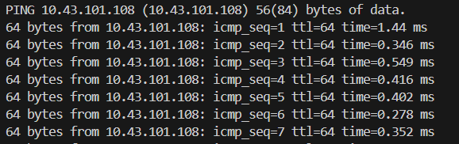
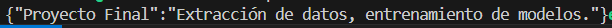

Antes de empezar, entendemos como accedemos a la información de la api correspondiente

```bash
# comprobamos si obtenemos respuesta con la ip via pin 
ping 10.43.101.108
```


```bash 
#   Accedemos al puerta publicado para verificar conectividad a la API (endpoint raíz)
curl http://10.43.101.108:80
```


```bash
#   indagamos sobre el contenido de la api
curl http://10.43.101.108:80/openapi.json
```

/home/estudiante/Documents/ProyectoFinal_MLOps_PUJ

Rutas encontradas
/metrics con método GET usando Prometheus 
/health con método GET para verificar con status OK
/data con método GET con información necesaría `group_number` y `day`
/restart_data_generation con método GET con información necesaria `group_number` y `day`

Con lo que nuestras consultas a la api serán llevadas a cabo de 

```plaintext
http://10.43.101.108:80/data?group_number=6&day=Wednesday
http://10.43.101.108:80/restart_data_generation?group_number=6&day=Wednesday
```


creamos el proyecto inicialmente utilizando docker compose para levantar y crear todo el esquema en desarrollo

```bash
docker compose up airflow-init 
docker compose up --build -d 
docker compose down -v --rmi all 

```

```bash
docker compose exec mlops-postgres psql -U airflow -d airflow -c "\l"
docker compose exec mlops-postgres psql -U airflow -d airflow -c "\dt *.*"
sudo chown -R estudiante:estudiante dags
sudo chmod -R u+rwX dags

```

```bash
export DOCKER_BUILDKIT=0
```


**Nota:** Trabajaremos con fernet key

```plaintext
http://localhost:8080      #   airflow
http://localhost:9001      #   minio
http://localhost:5000      #   mlflow
http://localhost:8888        # jupyterlab
```

anotación, para hacer tunel usando port forwarding a traves de la conexión ssh de la vm 

Creación DAGS

```bash 
docker compose exec mlops-postgres psql -U airflow -d airflow -c "DROP SCHEMA raw_data CASCADE; DROP SCHEMA clean_data CASCADE;"
```

